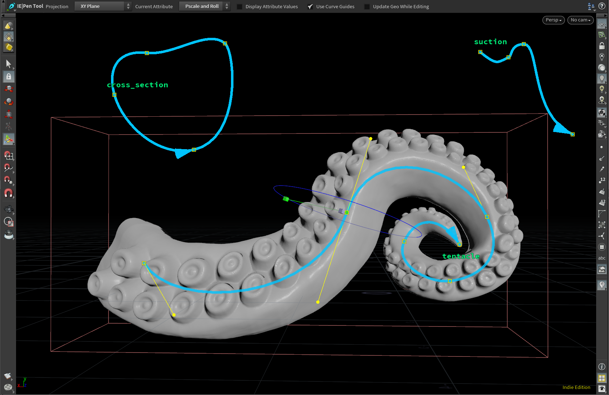
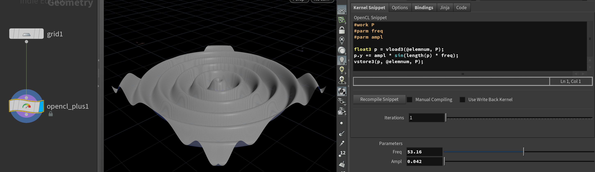
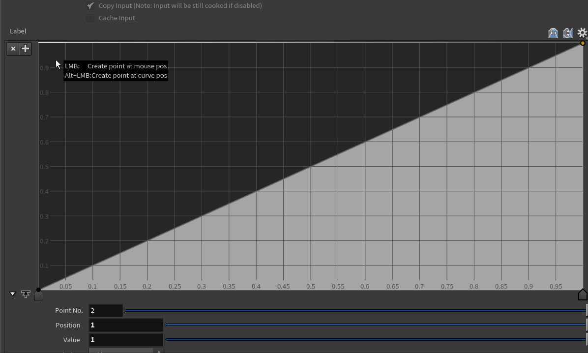
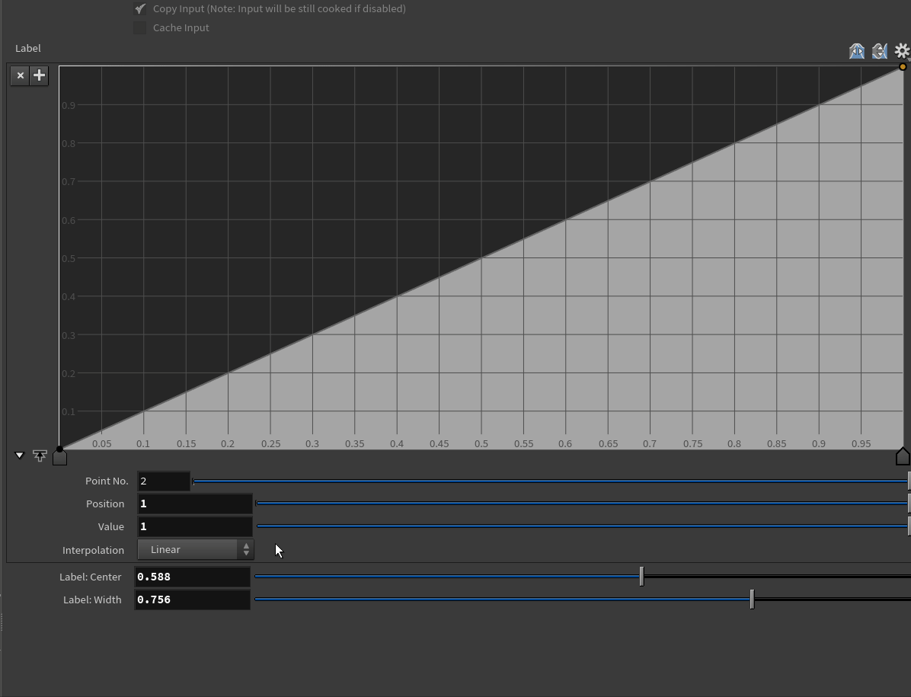

# Houdini Tools  <!-- omit in toc --> 

Compatible only with Python 3 builds

- [Pen Tool](#pen-tool)
- [OpenCL+](#opencl)
- [SOP Subnetwork Verbifier](#sop-subnetwork-verbifier)
- [Gradient Picker](#gradient-picker)
- [Ramp Sketch](#ramp-sketch)
- [Parametric Ramps](#parametric-ramps)

## Pen Tool

Draw bezier curves as in other DCCs

## OpenCL+

OpenCL SOP wrapper to automate most of the boilerplate work.
More info: [OpenCL+ Readme](help/OpenCL_Plus.md)

## SOP Subnetwork Verbifier

Generate SOP Verb function from arbitrary network (considering all the nodes have verbs)
More info: [Verbifier](help/verbifier.md)

## Gradient Picker

Pick gradient from screen for color ramps.
Hold Shift for picking raw color without gamma corrections (2.2 Gamma adjusted by default)

Also works as a color picker from screen for color parms

## Ramp Sketch

Draw a ramp on screen.
Hold Shift for creating a BSpline ramp (Linear by default)

## Parametric Ramps

Setup ramp control parameters for common remapping functions. 
