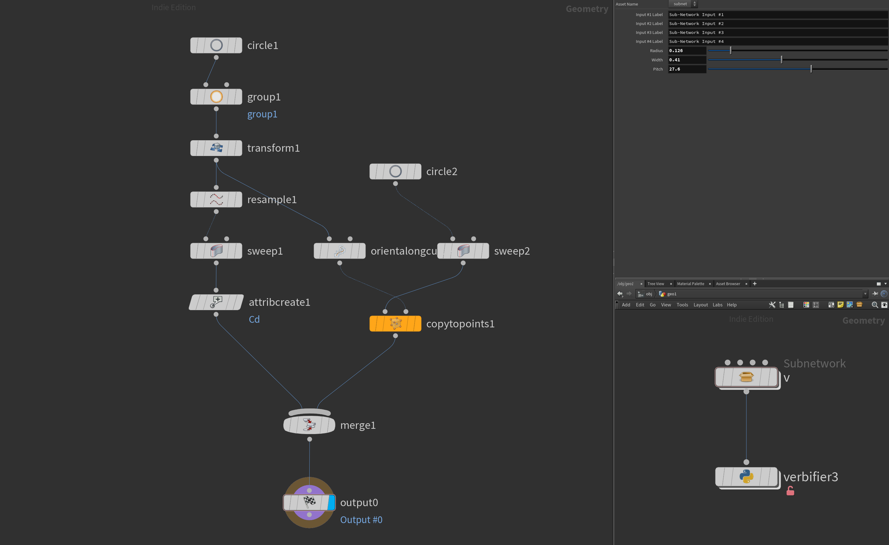
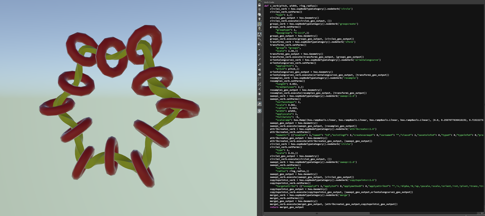

# Subnetwork Verbifier

Just create an arbitrary SOP Subnetwork and promote parameteres to the subnetwork level. 
Connect the output of the subnet to Verbifier SOP.

The Verbifier will generate a function with arguments accordingly to the promoted parameters. 

Hit *Rebuild* button to rebuild function source.

*Note*: Currently it passes tuples as an individual components 

  